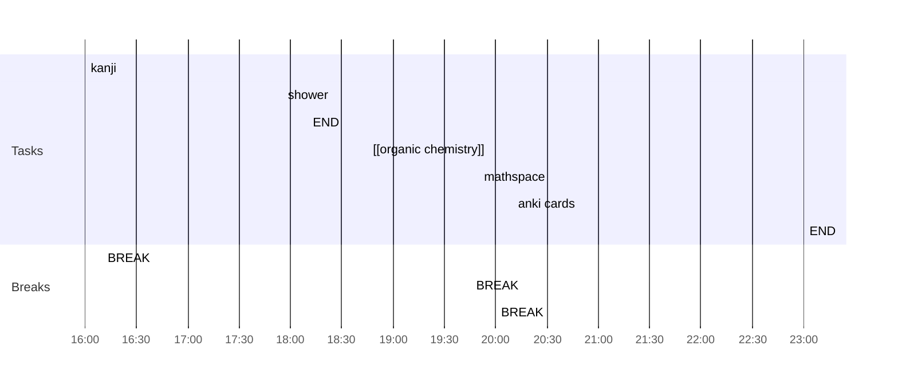

## Day Planner

- [x] 16:00 kanji
- [x] 16:10 BREAK
- [x] 17:55 shower
- [ ] 18:10 END
- [x] 18:45 [[organic chemistry]]
- [x] 19:45 BREAK
- [x] 19:50 mathspace
- [x] 20:00 BREAK
- [ ] 20:10 anki cards
- [ ] 23:00 END