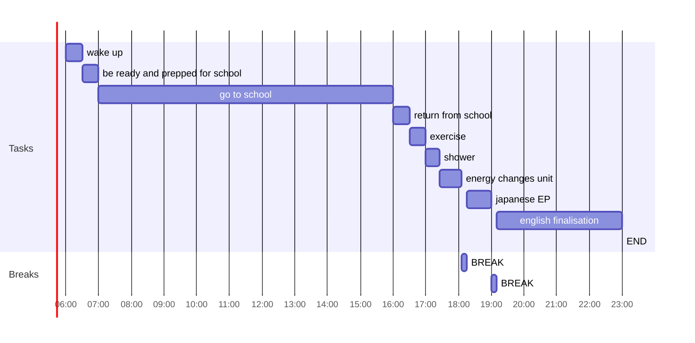

## Day Planner

- [x] 06:00 wake up
- [x] 06:30 be ready and prepped for school
- [x] 07:00 go to school
- [x] 16:00 return from school
- [x] 16:30 exercise
- [x] 17:00 shower
- [ ] 17:25 energy changes unit
- [ ] 18:05 BREAK
- [ ] 18:15 japanese EP
- [ ] 19:00 BREAK
- [ ] 19:10 english finalisation
- [ ] 23:00 END