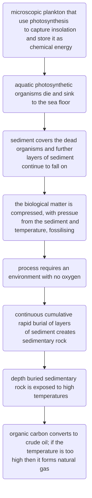

#ztlit 
[[skirvingOrganicChemistryEnergy2023]]

## uses of energy

| direct | indirect |
| --- | ---|
|stored chemical energy in laptop transformed to _light energy_ in the display| heat and electrical energy involved in the production of a laptop|
|respiration converts the stored chemical energy into _ATP energy_ for cells|photosynthesis converts light energy into stored chemical energy in the form of food, food is consumed|
|solar cells converts insolation into _electrical energy_ to power appliances|electrical energy used in order to produce solar cells|
## direct energy
 - direct energy usage is the usage of energy consumed 
## indirect energy
 - indirect energy usage is energy associated with production.
## process of fossil fuel formation
- natural gas
- crude oil

- coal