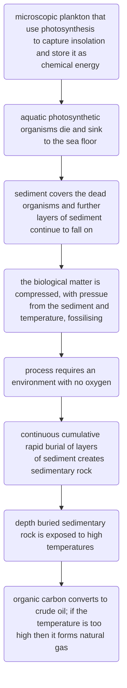

#ztlit 
[[skirvingOrganicChemistryEnergy2023]]
# objectives
- [x] I can state what energy is.  [completion:: 2023-07-20]
	- [[#energy]]
- [ ] I can describe what is meant by energy consumption.
	- [[#energy consumption]]
- [ ] I can explain how energy is used in everyday life.
- [ ] I can describe the direct use of energy in everyday life, e.g. lighting heating, fuel for transport etc.
- [ ] I can describe how energy is consumed indirectly.
- [ ] I can explain how indirect consumption of energy is associated with the production of consumer goods, energy required to build homes and infrastructure, energy for transporting goods and growing food etc.
- [ ] I can compare direct and indirect use of energy in everyday life.
# energy
- energy is the ability to do work.
## direct energy
- direct energy is energy used by oneself.
## indirect energy
- indirect energy is energy associated with production.
## energy consumption
- all the energy required to perform an action, which includes the indirect energy of the manufacturing of the product as well as the energy it use.
## uses of energy

| direct | indirect |
| --- | ---|
|stored chemical energy in laptop transformed to _light energy_ in the display| heat and electrical energy involved in the production of a laptop|
|respiration converts the stored chemical energy into _ATP energy_ for cells|photosynthesis converts light energy into stored chemical energy in the form of food, food is consumed|
|solar cells converts insolation into _electrical energy_ to power appliances|electrical energy used in order to produce solar cells|

# process of fossil fuel formation
## natural gas formation
## crude oil formation

## coal formation